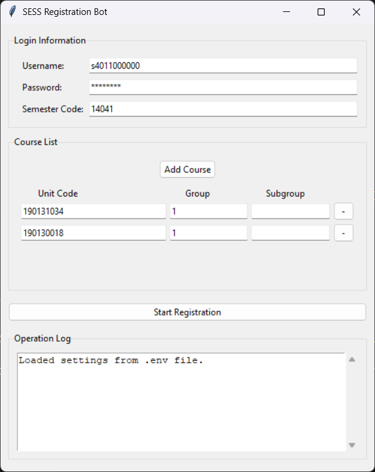

# 🤖 Shahrekord University (SESS) Registration Bot

<p align="center">
  
  
</p>

This project is a Python script that fully automates the course registration process on the **SESS academic portal** for Shahrekord University. The bot can be run via a user-friendly graphical interface (GUI) or a command-line interface (CLI).

Using the Selenium library, the bot handles logging in, waiting for the registration window to open, and registering for a predefined list of courses automatically.



## ✨ Features

- **User-friendly Graphical Interface (GUI)** for easy configuration and execution.
- **Dual Mode Operation**: Can be run with the GUI (default) or in CLI mode for scripting.
- **Automatic Login**: Securely logs into the SESS portal using your credentials.
- **Smart Retry Mechanism**: If the registration window isn't open, the bot intelligently retries every 10 seconds.
- **Handles Critical Errors**: Detects if registration is blocked due to incomplete course evaluations and stops the process.
- **Dynamic Course Management**: Easily add or remove courses directly in the GUI.
- **Subgroup Support**: Handles courses with and without subgroups (e.g., lab sections).
- **System Message Handling**: Intelligently processes system feedback messages (success, time conflicts, credit limit, etc.).
- **Status Reporting**: Checks and reports the reasons why certain courses are unavailable for registration.

---

## ⚙️ Setup & Installation

Follow these steps to get the project up and running.

### 1. Prerequisites

- **Python 3.8** or higher.
- **Google Chrome** browser.

### 2. Installation

1.  First, clone the repository to your local machine:
    ```bash
    git clone [https://github.com/rashcode-com/Sess-Registration-Bot.git](https://github.com/rashcode-com/Sess-Registration-Bot.git)
    cd Sess-Registration-Bot
    ```

2.  Install the required dependencies using `pip`. It's highly recommended to do this within a virtual environment.
    ```bash
    pip install -r requirements.txt
    ```

### 3. Configuration

The application uses a `.env` file to store your settings. The way you configure this file depends on how you run the bot.

**For GUI Users (Recommended):**
You do not need to create the `.env` file manually. The first time you run the application (`python main.py`), the file will be created automatically. You can then enter your username, password, courses, and semester directly into the graphical interface, and your settings will be saved to the `.env` file for the next time you run the app.

**For CLI Users:**
Before running in CLI mode, you **must** create and configure the `.env` file manually. The easiest way is to make a copy of the provided sample file:

```bash
# On Windows
copy .env.sample .env

# On Linux or macOS
cp .env.sample .env
```
Then, open the `.env` file and fill in your personal information according to the table below.

| Variable      | Description                                                                                          | Example                       |
| :------------ | :--------------------------------------------------------------------------------------------------- | :---------------------------- |
| `SESS_USERNAME` | Your student ID number.                                                                              | `s4011000000`                   |
| `SESS_PASSWORD` | Your password for the SESS portal.                                                                   | `YourPassword`                  |
| `COURSES`     | A comma-separated list of courses. Format: `unit_code:group_code` or `unit_code:group_code:subgroup_code`. | `"190200000:1,190100000:1:1"` |
| `SEMESTER`    | The 5-digit code for the academic semester.                                                          | `"14041"`                       |

---

## 🚀 How to Run

You can run the application in two modes:

### Running the GUI (Recommended)

This is the default mode. Simply run the `main.py` script without any arguments. The graphical interface will launch, allowing you to manage your settings and start the bot.

```bash
python main.py
```

### Running in CLI Mode

you can use the command-line interface by passing the `--cli` argument.

```bash
python main.py --cli
```

The bot will launch a Chrome browser and begin the automated registration process. A full report of its actions will be logged.

---

## ⚖️ Disclaimer

This tool was developed for educational purposes and to facilitate the personal course registration process. The user is solely responsible for any misuse of this script.